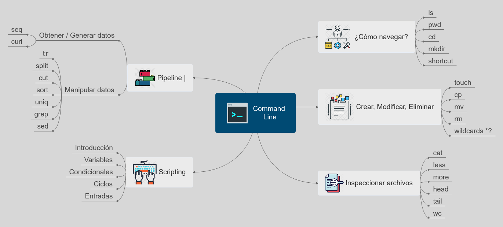

Command Line | Línea de comandos
==========

## La computadora
Las computadoras sólo hacen cuatro cosas:

 1. Ejecutan programas
 2. Almacenan datos
 3. Se comunican entre sí para hacer las cosas recién mencionadas.
 4. Interactúan con nosotros. La interacción puede ser:
 - gráfica (como están acostumbrados) - conocida también como **GUI** (Graphical User Interface)
 - vía el ratón u otro periférico, o desde la línea de comandos, llamada como **CLI**(Command Line Interface).

## Shell
De una manera muy rápida el shell puede hacer lo siguiente:
* Un intérprete interactivo: lee comandos, encuentra los programas correspondientes, los ejecuta y despliega la
salida.
– Esto se conoce como **REPL**: Read, Evaluate, Print, Loop

* Mantiene un histórico que permite rejecutar cosas del pasado.
* La información es guardada jerárquicamente en carpetas o directorios.
* Existen comandos para hacer búsquedas dentro de archivos (**grep**) o para buscar archivos (**find**) que combinados pueden ser muy poderosos (se puede hacer data analysis solamente con estos comandos, así de poderosos son).
* Las ejecuciones pueden ser pausadas, ejecutadas en segundo plano o en máquinas remotas.
* Además es posible definir variables para usarse por otros programas.
* El `shell` cuenta con todo un lenguaje de programación, lo que permite ejecutar cosas en bucles, condicionales, y hasta cosas en paralelo.

### ¿Por qué es importante?
* En muchas ocasiones tendrán que conectarse a servidores remotos, la mayoría utilizando una terminal o algún programa como `putty` y solamente tendrá la línea de comandos para obtener información, o hacer estadística, limpiar archivos, crear procesos, etc.... quizá solo tengan algún editor de texto com `vi, vim, nano o pico`, nada de IDE's incluso ni python ni R, por lo que el saber utilizar la CLI les salvará la vida!!!
El más popular es `bash`, que es un acrónimo de **Bourne again shell**.

## Elements
  * User
  * HostName
  * Current Directory
  * Prompt  

``` shell
hatshex@hatshex-land:~/daten/Projects/2020/int03_mentorias/Command_Line$  
```


## ¿Cómo navegar? 
ls
===================================================================
Muestra los archivos y directorios ubicados en el directorio actual
```
ls
ls -a # Lista archivos ocultos
ls -l # Lista información adicional 
ls -F # Lista solamente directorios
ls -l my_scr?pt
ls -l my*
ls -l my_scr[ai]pt
```

pwd
===================================================================
Muestra la ruta del directorio actual
```
pwd
```

cd
===================================================================
Cambia el directorio actual al directorio que se especifique
```
cd /var

cd ~

cd daten 

cd 


```

mkdir
===================================================================
Crea carpetas
```
mkdir test mentorias

mkdir test\ mentorias

mkdir 'test mentorias'
```


atajos
===================================================================
Moverse rápidamente en la **CLI** es de vital importancia. 
```
Hoy es un buen día para aprender línea de comandos
```
- `Ctrl + a` Inicio de la línea
- `Ctrl + e` Fin de la línea
- `Ctrl + r` Buscar hacia atrás
  - Elimina el *flechita arriba*
- `Ctrl + b` / `Alt + b` Salta entre caracteres / Salta entre palabras | Hacia atrás
- `Ctrl + f` / `Alt + f` Salta entre caracteres / Salta entre palabras | Hacia adelante
- `Ctrl + k` - Elimina el resto de la línea (en realidad corta y pone en el búfer circular)
- `Ctrl + y` - Pega la último del búfer.
- `Alt + y`  - Recorre el búfer circular.
- `Ctrl + d` - Cierra la terminal
- `Ctrl + z` - Manda a *background*
- `Ctrl + c` - Intenta cancelar

## Crear, Modificar, Eliminar archivos y carpetas
touch
===================================================================
Crea archivos
```
touch prueba.txt

nano prueba.txt
```


cp
===================================================================
Copia archivos o directorios a la ruta que se especifique
```
cp test_fuente.txt test_destino.txt

ls -l test_*

cp -i test_fuente.txt test_destino.txt
```


mv
===================================================================
Renombra archivos o directorios
```
mv test_fuente.txt test_fuente2.txt

ls -l test_*

```


rm
===================================================================
Elimina archivos o directorios
```
rm -i test_*

rm test_*
```

## Inspeccionar archivos
cat
===================================================================
- `cat` concatena archivos y/o imprime al `stdout`

```
> echo 'Hola mundo' >> test

> echo 'Adios mundo cruel' >> test

> cat test

...

> rm test

> cd data

> cat UFO-Nov-2014.tsv UFO-Dic-2014.tsv  > UFO-Nov-Dic-2014.tsv

> wc -l UFO-Nov-Dic-2014.tsv
```
less
===================================================================

more
===================================================================

head, tail
===================================================================
- `head` y `tail` sirven para explorar visualmente las primeras diez
(default) o las últimas diez (default) renglones del archivo,
respectivamente.


```
> head /etc/passwd
> tail -3 /etc/passwd
```

wc
================================================================
- `wc` significa *word count*
  - Cuenta palabras,renglones, bytes, etc.
- Es un buen momento para aprender que existe un manual.
  - `man wc`
- En nuestro caso nos interesa la bandera `-l` la cual sirve para contar líneas.

```
> seq 30 | grep 3 | wc -l
```

```
> wc -l prueba.txt 
53 prueba.txt

```

## Pipes y flujos

Pipe
========================================================
- `|` (pipe) “Entuba” la salida de un comando al siguiente 
```
# grep "busca y selecciona" cadenas o patrones
> seq 50 | grep 3
```
stdin, stdout
========================================================
- `>`,`>>`, Redirecciona la salida de los comandos a un sumidero.
``` shell
> ls > prueba.txt
> ls -la   >> prueba.txt
> ls -lah  >> prueba.txt
> ls -laht >> prueba.txt
```

- `<` Redirecciona desde el archivo

```
> sort < prueba.txt # A la línea de comandos acomoda con sort,
> sort < prueba.txt > prueba_sort.txt # Guardar el sort a un archivo.
```

Condicionales
===============================================================

- `&&` es un AND, sólo ejecuta el comando que sigue a `&&` si el
primero es exitoso.

```
> ls && echo "Hola"
> lss && echo "Hola"
```

seq
===================================================================
Genera secuencias de números...

```
> seq 5

> seq 3 10

> seq -s '|' 10

> seq -w 1 10
```

curl
===============================================================

- Obtener datos desde el internet...

```
# The Time Machine de H.G. Wells, desde el Proyecto Gutenberg
~ curl http://www.gutenberg.org/cache/epub/100/pg100.txt
```

```
# Sin el progress bar (útil cuando vamos a hacer un pipe a otro comando)
~ curl -s --compressed http://www.gutenberg.org/cache/epub/100/pg100.txt
```

- La opción `-u` por si lo piden usuario y password

```
~ curl -u username:password ...
```

- La opción `-L` por si hay redirecciones, por ejemplo si el `URL` empieza con  `http://bit.ly/...`

- También podemos descargar y ejecutar archivos de configuración
```
> curl -L https://github.com/hatshex/Mata-burros/blob/master/utils/github.sh | sh 
```


tr
========================================================
Cambia, reemplaza o borra caracteres del `stdin` al `stdout`

```
> man tr

> echo "Hola el equipo RICH IT les da la BIENVENIDA  a las mentorías" | tr '[:upper:]' '[:lower:]'

> echo "Hola el equipo RICH IT les da la BIENVENIDA a las mentorías"  | tr -d ' '

> echo "Hola el equipo RICH IT les da la BIENVENIDA a las mentorías"  | tr -s ' ' '_'

```


split
===================================================================

- `split` hace la función contraria, divide archivos.
- Puede hacerlo por tamaño (bytes, `-b`) o por líneas (`-l`).

```
> split -l 500 UFO-Nov-Dic-2014.tsv
> wc -l UFO-Nov-Dic-2014.tsv
```


```
> echo "Hoy es $(date)"
> echo 'Hola mundo' >> test
> echo 'Adios mundo cruel' >> test
> cat test
...
> cp test test2
> cat test test2 > test3
> wc -l test*
```

cut
===================================================================
- Con `cut` podemos dividir el archivo pero por columnas.
- Donde columnas puede estar definido como campo (`-f`), en
conjunción con (`-d`), carácter (`-c`) o bytes (`-b`).
- En este curso nos interesa partir por campo.

**NOTA**: Para partir por tabulador usa `-d$'\t'`

```
$ echo "Gabs|2018|RICH IT|Data Science" >> prueba.psv
$ echo "Patty|2015|SCJN|Abogada" >> prueba.psv
$ echo "Sara|2010|TELCEL|Ingeniero" >> prueba.psv
$ cut -d'|' -f1 prueba.psv
$ cut -d'|' -f1,3 prueba.psv
$ cut -d'|' -f1-3 prueba.psv
```


uniq y sort
===============================================================

- `uniq` Identifica aquellos renglones consecutivos que son iguales.
- `uniq` puede contar (`-c`), eliminar (`-u`), imprimir sólo las duplicadas
(`-d`), etc.
- `sort` Ordena el archivo, es muy poderoso, puede ordenar por
columnas (`-k`), usar ordenamiento numérico (`-g`, `-h`, `-n`), mes
(`-M`), random (`-r`) etc.

```
sort -t "," -k 2  UFO-Nov-Dic-2014.tsv
```

uniq y sort
===============================================================

- Combinados podemos tener un `group by`:

```
# Group by por timestamp y estado
 cat UFO-Dic-2014.tsv \
      | cut -d$'\t' -f1,3 \
      | sort -t $'\t' -k 2 -k 1 \
      | uniq -c | head
```


grep
========================================================

`grep` nos permite buscar líneas que tengan un patrón específico

```
> echo "Hola grupo ¿Cómo están?" | grep -oE '\w+'
> grep "CA" UFO-Nov-2014.tsv
> grep "HOAX" UFO-Nov-2014.tsv
> grep -v "18:" UFO-Nov-2014.tsv
> grep -E "18:|19:|20:" UFO-Nov-2014.tsv
> grep -E "[B|b]lue|[O|o]range" UFO-Nov2014.tsv \
        | grep -v "Orangebug"
> grep -i -E "[blue|orange]" UFO-Dic-2014.tsv
> grep -c -o -E "[B|b]lue|[O|o]range" UFO-Nov-2014.tsv  # Ejecuta una bandera a la vez
> grep -o -E "[B|b]lue|[O|o]range" UFO-Nov-2014.tsv | sort | uniq -c
> grep "\/[0-9]\{1,2\}\/" UFO-Dic-2014.tsv # Seleccionamos días
> grep -v "\/[0-9]\{4\}" UFO-Dic-2014.tsv  # Año mal formateado
> grep -E "([aeiou]).*\1" names.txt # Vocal caracteres Misma vocal
```

sed
=========================================================

- `sed` significa *stream editor* . Permite editar archivos de manera automática.
- El comando tiene cuatro *espacios*
  - Flujo de entrada
  - Patrón
  - Búfer
  - Flujo de salida
- Entonces, `sed` lee el *flujo de entrada* hasta que encuentra `\n`. Lo copia al *espacio patrón*, y es ahí donde se realizan las operaciones con los datos. El *búfer* está para su uso, pero es opcional, es un búfer, vamos. Y finalmente copia al *flujo de salida*.


sed
==========================================================
```
echo "Buenos días en la CDMX" | sed 's/CDMX/Ciudad de México/'
> sed 's/foo/bar/' data3.txt   # Sustituye foo por bar
> sed -n 's/foo/bar/' data3.txt # Lo mismo pero no imprime a la salida
> sed -n 's/foo/bar/; p' data3.txt # Lo mismo pero el comando "p", imprime
> sed -n 's/foo/bar/' -e p data3.txt # Si no queremos separar por espacios
> sed '3s/foo/bar/'  data3.txt # Sólo la tercera linea
> sed '3!s/foo/bar/'  data3.txt # Excluye la tercera línea
> sed '2,3s/foo/bar/' data3.txt # Con rango
> sed -n '2,3p' data3.txt  # Imprime sólo las líneas de la 2 a la 3
> sed -n '$p' # Imprime la última línea
> sed '/abc/,/-foo-/d' data3.txt # Elimina todas las líneas entre "abc" y "-foo-"
> sed '/123/s/foo/bar/g'  data3.txt
# Sustituye globalmente "foo" por "bar" en las líneas que tengan 123
> sed 1d data2.txt # Elimina la primera línea del archivo
> sed -i 1d data2.txt  # Elimina la primera línea del archivo de manera interactiva
```


Bash programming
========================================================
- Al final hay que poner esto en un archivo, ponerlo a correr e irnos
  a pensar...
- Para cualquier programa *script* es importante que la primera línea del archivo le diga a bash que comando usar para ejecutarlo.

- También hay dar permisos de ejecución al archivo

```
~ chmod u+x ejemplo.py
```

Bash programming
========================================================

- A la primera línea se conoce como *shebang* y se representa por `#!` seguido de la ruta al ejecutable

Variables
========================================================
a=z                     # Asignar la cadena "z" a la variable a
b="a string"            # Asignar cadenas entre comillas.
c="a string and $b"     # ASignar cadena y valor de variable
d="$(ls -l README.md)"  # Resultado de un comando
e=$((5 * 7))            # Operaciones aritméticas

nombre_archivo="Prueba.txt"
touch $nombre_archivo 
mv "$nombre_archivo" "$nombre_archivo1"
mv "$nombre_archivo" "${nombre_archivo}1"


Ciclos
========================================================
Podemos hacer _loops_ sobre varias cosas:

- Sobre números

```
for i in {0..5}
do
echo "Imprimiendo variable i: $i"
done
```
```
for i in {0..10..2}
do
echo "Imprimiendo variable i: $i"
done
```
```
for i in $(seq 1 2 20)
do
   echo "Imprimiendo variable i: $i"
done
```

- Sobre líneas

```
curl -s --compressed http://www.gutenberg.org/cache/epub/35/pg35.txt > time_machine.txt

i=0
while read line
do
((++i)) 
echo "Línea $i : ${line}"
done < time_machine.txt
```

Serie
========================================================

- Y sobre archivos

```
cd /home/hatshex/daten/Projects/2020/int03_mentorias/Command_Line
## Listar todos los archivos *.md
for archivo in ./*.md
do
echo "El archivo es ${archivo}"
done
```
Esto último tiene muchos problemas (no maneja espacios o caracteres raros, por ejemplo).

Una mejor alternativa es `find`

```
find awk_sed -name '*.txt' -exec echo "El archivo es {}" \;
```

Además `find` permite buscar por fecha, tamaño, fecha de acceso, permisos, etc.


